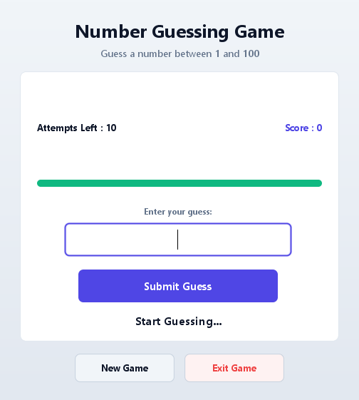
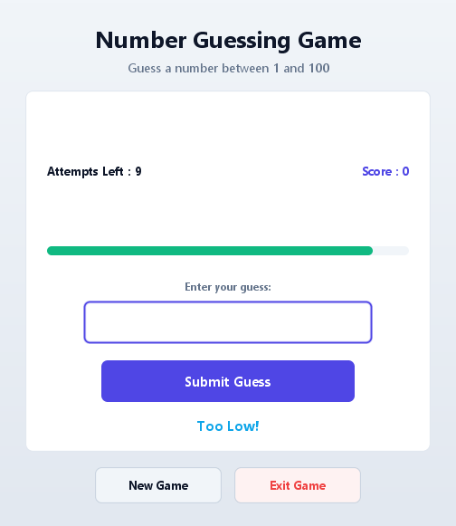

# 🎯 Modern Number Guessing Game

A sleek, responsive, and modern desktop implementation of the classic **Number Guessing Game**, built in pure Java Swing with zero external dependencies.

[](https://www.oracle.com/java/)
[](https://github.com/rupampatle25/NumberGuessingGame)
[-brightgreen?style=for-the-badge)](NumberGameTest.java)
[](LICENSE)

---

## 📸 Screenshots

<p align="center">
  
  &nbsp; &nbsp;
  
</p>

<p align="center">
  <em>Left: Initial game screen &bull; Right: Interactive gameplay with dynamic feedback and attempts tracker</em>
</p>

---

## ✨ Features & Highlights

### 🎨 Modern Visual Design
- **Indigo & Slate Design System**: Clean, high-contrast, modern color palette with dark mode/light contrast sensibilities.
- **Card-Based UI with Subtle Shadows**: Smooth rounded cards (`RoundedCard`) featuring soft drop shadows and clean borders replacing outdated flat dialogs.
- **Sub-Pixel Anti-Aliased Graphics**: Global font smoothing (`awt.useSystemAAFontSettings`, `swing.aatext`) and high-fidelity 2D rendering hints enabled out-of-the-box.
- **Responsive Layout**: Adapts gracefully across varying display scales and resolutions.

### ⚡ Micro-Interactions & Rich Feedback
- **Dynamic Attempts Progress Bar**: Visual progress indicator (10 down to 0 attempts) that dynamically changes color:
  - 🟢 **7–10 attempts**: Vibrant Emerald
  - 🟡 **4–6 attempts**: Warning Amber
  - 🔴 **1–3 attempts**: Critical Rose
- **Toast Notifications**: Non-intrusive animated toast popups for user validation warnings (e.g., empty inputs or out-of-range guesses).
- **Haptic Shake Feedback**: The input field subtly shakes when invalid input is entered.
- **Celebratory Particle Confetti Burst**: Animated confetti celebration upon successfully guessing the secret number.

### ⌨️ Keyboard Shortcuts & Accessibility
- <kbd>Enter</kbd>: Submit current guess.
- <kbd>Ctrl</kbd> + <kbd>N</kbd> or <kbd>F2</kbd>: Start a new round.
- <kbd>Esc</kbd>: Exit game with confirmation.
- **Tab Navigation**: Full keyboard focus ring on inputs and action buttons.

---

## 🎮 Game Rules & Scoring

- **Secret Number**: Random integer between `1` and `100`.
- **Attempts**: Each player is granted `10` attempts per round.
- **Scoring**: Points awarded upon winning: `(attempts + 1) * 10`.
- **Input Validation**:
  - Only integers between `1` and `100` are accepted.
  - Invalid inputs (non-numbers, blank, out-of-bounds) do not penalize or consume attempts.

---

## 📁 Project Structure

```text
NumberGuessingGame/
│
├── NumberGame.java          # Core application & modern custom Swing UI components
├── NumberGameTest.java      # Comprehensive automated test suite
├── README.md                # Project documentation
├── .gitignore               # Ignored build artifacts and OS files
│
└── screenshots/
    ├── screenshot.png       # Initial welcome state preview
    └── gameplay.png         # Active gameplay preview
```

---

## 🚀 Getting Started

### Prerequisites
- **Java Development Kit (JDK 8 or higher)** installed.
- Verify your Java installation:
  ```bash
  java -version
  javac -version
  ```

### 1. Clone the Repository
```bash
git clone https://github.com/rupampatle25/NumberGuessingGame.git
cd NumberGuessingGame
```

### 2. Compile the Game
```bash
javac -encoding UTF-8 NumberGame.java
```

### 3. Run the Game
```bash
java NumberGame
```

### 4. Run the Automated Tests
```bash
javac -encoding UTF-8 NumberGame.java NumberGameTest.java
java NumberGameTest
```

Expected test output:
```text
Running comprehensive tests for NumberGame...
[PASS] Initial attempts initialized to 10
[PASS] Secret number is within [1, 100]: ...
[PASS] Empty input rejected without consuming attempts
[PASS] Non-numeric input rejected without consuming attempts
[PASS] Out-of-bounds input rejected without consuming attempts
[PASS] Valid guess decremented attempts from 10 to 9
[PASS] Higher guess decremented attempts from 9 to 8
[PASS] Correct guess logic verified: totalGames=1, gamesWon=1, score=...
[PASS] Game Over logic verified: attempts=0, submit disabled, totalGames=...

-------------------------------------------
TEST SUMMARY: 9 Passed, 0 Failed.
-------------------------------------------
```

---

## 📜 License

This project is open source and available under the [MIT License](LICENSE).
